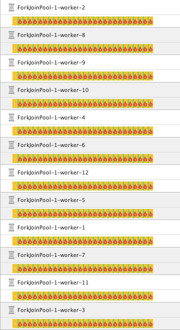

# TIL

🔥 N X CPU threads == CPU threads x N

Single work is done in 3s. (`RunSingleWork`)

## Cached pool (no limit) - `RunCompletableWork`

 | Multiplier | Time  |
|------------|-------|
| x1         | 4.8s  |
| x2         | 8.6s  |
| x3         | 13.2s |
| x4         | 17.2s |
| x5         | 21.3s |
| x6         | 26.5s |
| x7         | 30.8s |

## Fixed pool - `RunCompletableWork`

| Multiplier | Time  |
|------------|-------|
| x1         | 4.8s  |
| x2         | 9.0s  |
| x3         | 13.6s |
| x4         | 17.8s |
| x5         | 22.5s |
| x6         | 26.4s |
| x7         | 30.8s |

🔥 100 x CPUs in action: 

All threads are in Running state, but they all are starving.

🔥 Threads are starving when they can not run 100% of the time.

Here we see that CPU time is 2.9s = calculation time + some extra (probably context switching). However, it takes 23s to complete the task. CPU was doing other jobs for 88% of time.

🔥 Virtual thread pool in this case == Fixed thread pool

